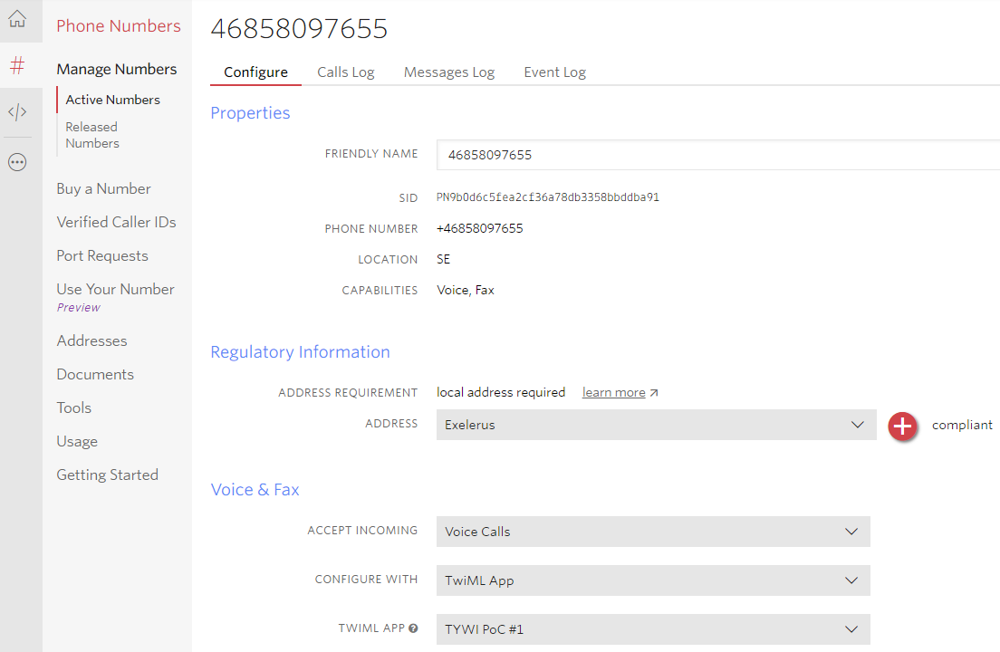
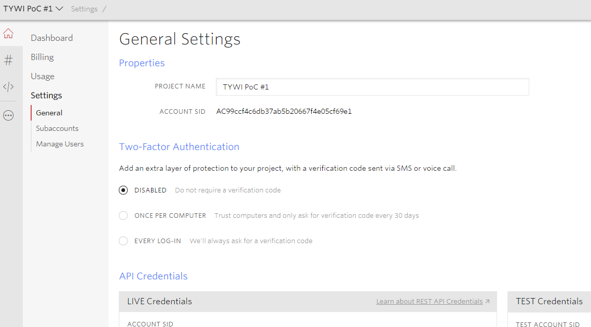
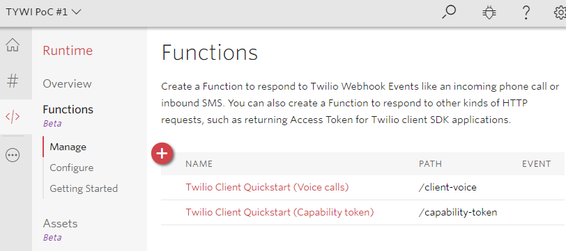
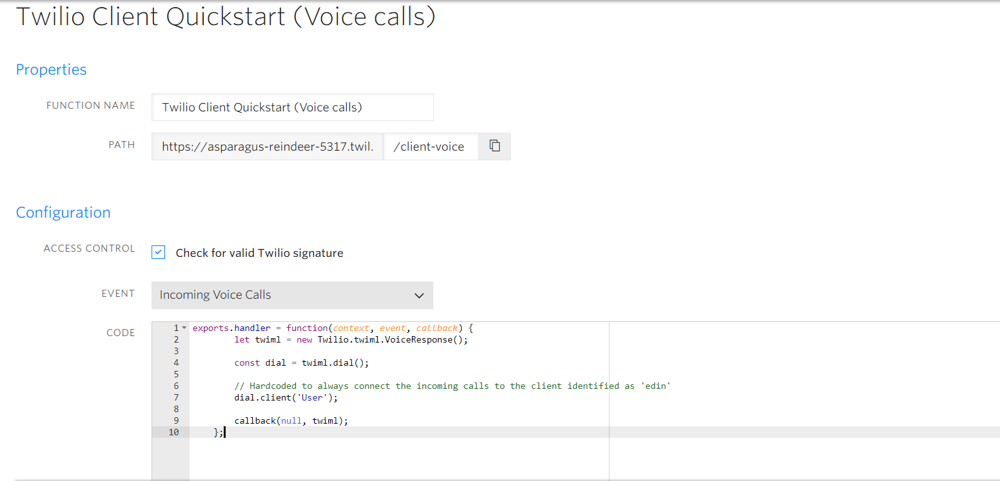
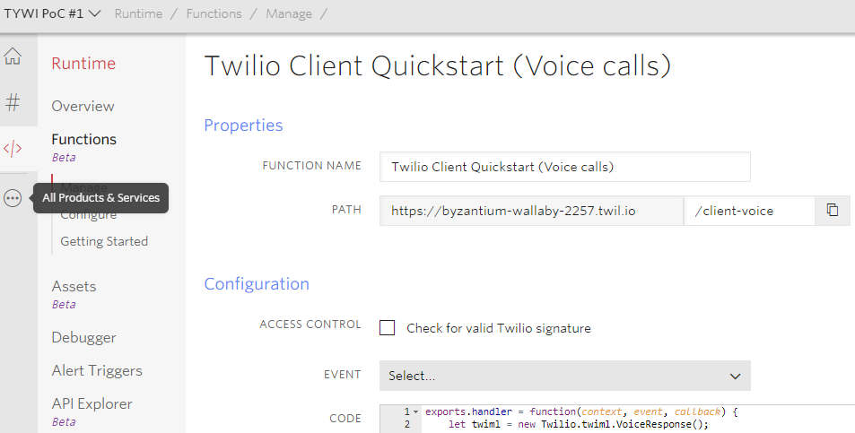
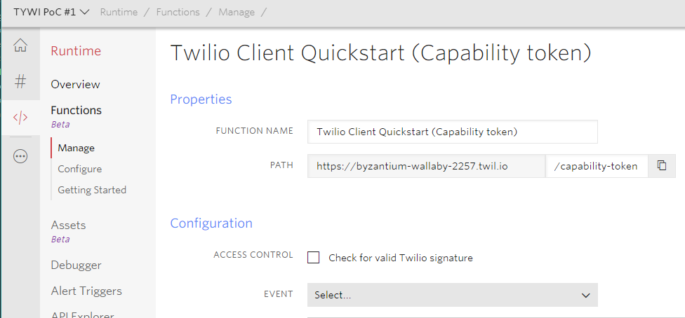
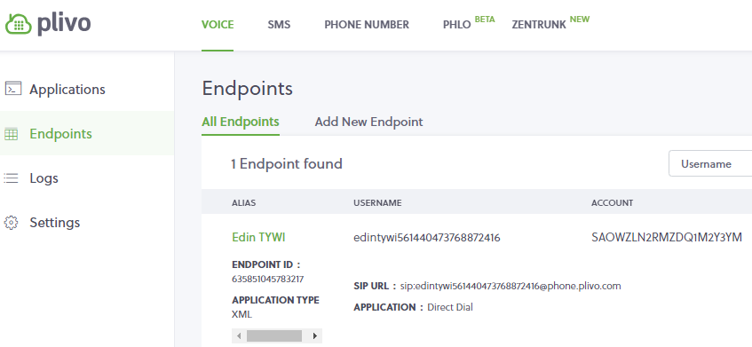
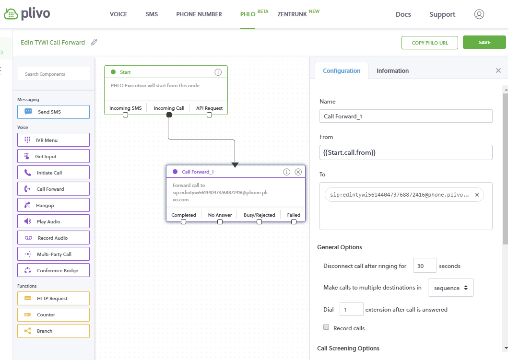
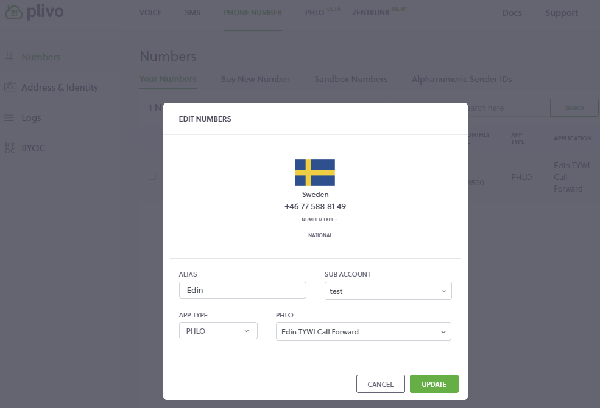

# 1. Overview
This purpose of this prototype is to facilitate translated speech between two participants in a voice call session:
* A person calling a phone number with his/her phone.
* An call center agent using a web page for communication.

This is essentially done as described below:

1.1 Capture and transcribe the audio from the incoming phone call.
 
* Capture the audio stream from an incoming Twilio/Plivo phone call. 
* Use the stream as input for the DAROWS speechcapture library to get audio chunks. 
* Send the captured audio chunks to the TYWI server in order to perform speech to text recognition.
* Present the resulting text on the web client. 

1.2 Capture, transcribe and translate the audio from the local microphone and play it back to the phone call.

* Capture the audio stream from the local microphone for the user of the web page.
* Use the stream as input for the DAROWS speechcapture library to get audio chunks.
* Send the captured audio chunks to the TYWI server in order to perform speech to text recognition and translation.
* Send back the resulting synthetic speech mp3 file of the translated speech to the phone call participant which initiated the call.

# 2. Twilio setup
In order to get the prototype up and running some configuration is needed to be performed in the Twilio 
web portal. The purpose of this is to create a phone number and direct call to this number to the web application.

2.1  Create a **Twilio phone number** with voice capabilities:


2.2  Create a **Twilio app** that is to be used for communication:

Please ensure that the phone number is connected to the app:

	
Use the **REQUEST URL** from the voice function created in step 2.4 below. This allows
incoming phone calls to the Twilio number to get routed to the Web application.
	
Since this project is for testing purposes only, it makes sense to disable the 
**SSL Certificate Validation** for the app.

And also, two Twilio Functions (Microservices hosted by Twilio) has to be created 
(If you use the Quickstart template, these will be created for you automatically):


2.3  configure Twilio Client Quickstart:
* **TWIML_APP_SID** = app ID
* **CALLER_ID** = number to call



2.4	Create a Twilio Function for handling Incoming voice calls:	


The code for this function should be changed to look like this:	
```
exports.handler = function(context, event, callback) {
let twiml = new Twilio.twiml.VoiceResponse();

const attr = isAValidPhoneNumber(event.To) ? 'number' : 'client';

console.log("attr:", attr, "event:", event, "context:",context);

if(event.Called && event.Called !== "") {
console.log("Calling from phone to client!");
const dial = twiml.dial({
//record: 'record-from-answer',
//trim: 'trim-silence'
});

dial.client('User');
}
else if(attr === 'number') {
console.log("Calling from client to phone!");
const dial = twiml.dial({
callerId: context.CALLER_ID
});
dial[attr]({}, event.To);
}
else {
console.log("error", context, event);
}

callback(null, twiml);
};

/**
* Checks if the given value is valid as phone number
* @param {Number|String} number
* @return {Boolean}
*/
function isAValidPhoneNumber(number) {
return /^[\d\+\-\(\) ]+$/.test(number);
}

Where 'User' is the identification we use for the capability function in step 2.5 below.


IMPORTANT: it is very possible that the Voice Geographic Permissions must be enabled in the Twilio account
in this link: https://www.twilio.com/console/voice/calls/geo-permissions/

2.5 Create a Twilio Function for handling capabilities:

Please note that the only change needed here is to set the identity as the 'User' user, which will ensure
that incoming calls to the Twilio phone number is routed to the web browser app:

   
There is only one change needed in the Quickstart template code for this function, which is the identity
(see the starred comment below):
   
```
exports.handler = function(context, event, callback) {
  let response = new Twilio.Response();

  // Add CORS Headers
  let headers = {
    "Access-Control-Allow-Origin": "*",
    "Access-Control-Allow-Methods": "GET",
    "Content-Type": "application/json"
  };
    
  // Set headers in response
  response.setHeaders(headers);
  
  response.setStatusCode(200);
  
  let ClientCapability = require('twilio').jwt.ClientCapability;

  // *** Set the identity as the 'User' user ***
  //
  const identity = 'User'
  const capability = new ClientCapability({
    accountSid: context.ACCOUNT_SID,
    authToken: context.AUTH_TOKEN,
  });

  capability.addScope(new ClientCapability.IncomingClientScope(identity));
  capability.addScope(new ClientCapability.OutgoingClientScope({
    applicationSid: context.TWIML_APP_SID,
    clientName: identity,
  }));

  // Include identity and token in a JSON response
  response.setBody({
    'identity': identity,
    'token': capability.toJwt()
  });
  
  callback(null, response);
};
```

# 3. Plivo setup (optional)
To get the prototype up and running with Plivo this configuration is needed in the Plivo web portal. 
The purpose of this is to create a phone number and direct call to this number to the web application using Plivo instead of Twilio as the call provider.
	
3.1 Create a new **Plivo Endpoint** (a SIP endpoint which represents this Web app):


3.2 Create a new **Plivo PHLO** (a Plivo app) which forwards calls to the endpoint above (the SIP URL):


3.3 Create a new **Plivo Phone number** and connect it to the **PHLO** from step 3.2:


# 4. Web Application Setup

The web app, includes the following files:
* index.html
* js/twiliospeechcapture.js
* js/CallProviders/CallProviderTwilio.js
* js/CallProviders/CallProviderPlivo.js
* css/site.css
* lib/darows.min.js

It is also dependent on a local configuration file (see 4.2):
* local-configuration.json

## 4.1 HTTPS
Should be hosted at a website with *HTTPS* as the access protocol. This is important, since microphone permissions 
etc. are dependent on secure web access in order to work correctly. *ngrok* is a good way to do this in local
development environments (https://ngrok.com).

## 4.2 local-configuration.json
In order to avoid collisions between developers when using the same code base:

4.1 Create a file in the directory 'simple-twilio-prototype/' named ***'local-configuration.json'***.
This file is ignored by git, so every developer must create their own local-configuration.json file.

4.2 The content of the file should be similar to this:
```
{
  "audioLog": true,
  "useCallProvider": "twilio",
  "callProviders": {
    "plivo": {
      "username": "[PLIVO_USERNAME]",
      "password": "[PLIVO_PASSWORD]"
    },
    "twilio": {
      "capabilityTokenFunctionURL": "[TWILIO_CAPABILITY_TOKEN_URL]"
    }
  },
  "TYWI": {
    "translateyourworldapi": "[TYWI_API_KEY]",
    "lang": "en-US",
    "vendor": "Microsoft"
  }
}
```
* *audioLog*: Show the captured audio as Audio elements on the web page.
* *useCallProvider*: Which provider to use: *twilio* and *plivo* are currently supported.
* *callProviders*: Contains the configuration for each CallProvider (see 4.2.2 and 4.2.3 below).
	
4.2.1 TYWI configuration
* *translateyourworldapi*: Replace with your TYWI API key.
* *lang*: The default input language e.g. "en-US".
* *vendor*: The translation vendor engine to use e.g. "google", "Microsoft" etc.
	
4.2.2 CallProvider configuration for Twilio 
* *capabilityTokenFunctionURL*: Replace with the URL for the Twilio capability token function from step 2.5.

4.2.3 CallProvider configuration for Plivo (optional)
* *username*: Your Plivo username.
* *password*: Your Plivo password.

# 6. Usage
If everything has been setup correctly, the web app can now be loaded in a browser (Preferably Chrome since
it as of today has the broadest WebRTC capabilities).

In order to comply with the new rules enforced by Chrome, regarding audio on Web Pages, which requires
user interaction to start the audio context, a button is shown on the web page with the text ***'Start Client'***.
When it is pressed, the Twilio setup code is run, which runs the capabilities function which registers
the web app as the 'User' user. Now incoming calls to the Twilio number can be routed to the web application.

# 7. Development
During development, a [gulp](https://gulpjs.com/) based support script is used to create distribution versions.

## Setup

1. Install node: [https://nodejs.org/en/download/](https://nodejs.org/en/download/)
2. Clone this project from GitHub.
3. Open project directory (TwilioToSpeech) from your command line (git bash is recommended on Windows: [https://gitforwindows.org/]().
4. Install all project dependencies using the node package manager (npm):
```javascript
npm install
```

5. In some cases you'll have also to install gulp globally:
```javascript
npm install -g gulp@3.9.1
```

## Build a distribution version
```javascript
gulp dist
```
This will automatically increase the patch version in package.json, and also add a copyright notice as a header in the resulting minified files (which is created in the directory 'dist'), which includes the version number.
You can then run http-server from this directory instead together with ngrok to test the distribution version of the app.

## Automatic build during development
```javascript
gulp dev
```
This task will continuously watch for any changes of the javascript source files, and automatically trigger distribution builds (same as running the command 'gulp dist') when the source is changed. Stop this command using 'CTRL-c'.